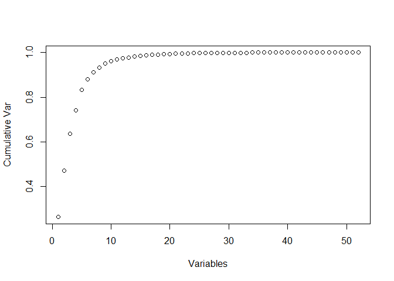

# Predicting manner of exercise
srngit  
Tuesday, December 20, 2014  
### Synopsis
Focus of this analysis is to predict "how(well)" the Weight Lifting Exercises was performed based on the Human Activity Recognition(HAR) activity data set.

Six young health participants were asked to perform one set of 10 repetitions of the Unilateral Dumbbell Biceps Curl in five different fashions: 

A : exactly according to the specification;
B : throwing the elbows to the front; 
C : lifting the dumbbell only halfway;
D : lowering the dumbbell only halfway;
E : throwing the hips to the front.

We are given the training and testing data sets. First step is to develop a model based on the training data set and then in the second step, apply the model to the test data to predict the Classe i.e. "how" the activity was performed.     

### Data Processing
The following data was given to analyse the data. 


```r
train <- read.csv("pml-training.csv")
test  <- read.csv("pml-testing.csv")
```

##### Preview of the Data: 

```r
dim(train)
```

```
## [1] 19622   160
```

```r
dim(test)
```

```
## [1]  20 160
```


```r
str(train)
str(test)
```

A preliminary review of the data shows that there are 19,622 observations and 160 variables in the training data set while the test data has just about 20 observations on 160 variables. The objective is to predict 'Classe' for the 20 observations in the test set. Data also shows that there are many columns missing values 'NA' in the training set.

##### Eliminating variables with NAs. 
All variables with NAs are unnecessary and hence removed from the data set.


```r
library(caret)
```

```
## Loading required package: lattice
## Loading required package: ggplot2
```

```r
train <- train[ , -colSums(is.na(train)) == 0]
```

##### Near Zero Variance
In the next data processing stage, all variables with near zero variance are eliminated, they do not contribute significantly in prediction. In addition, the first six(6) variables are just identifiers and time stamping data, and hence is removed.  


```r
nzv <- nearZeroVar(train,saveMetrics=TRUE)
nzvcols <- rownames(nzv)[nzv$nzv==TRUE]
train <- train[ , -which(names(train) %in% nzvcols)]
train <- train[ , -c(1:6)]
```

Now, we are left with 53 variables; a significant reduction from the initial 160. Principal Component Analysis is done on the data set to find how different variables work together to create the dynamics of the system and to find if there is any possibility of reducing the number of variables. 

##### Principal Component Analysis


```r
prComp <- prcomp(train[,-53])
plot(cumsum(prComp$sdev^2/sum(prComp$sdev^2)), xlab = "Variables", ylab="Cumulative Var")
```

 

```r
pr2 <- prcomp(train[,-53], tol=0.1)
od=prComp$x %*% t(prComp$rotation)
od2=pr2$x %*% t(pr2$rotation)
```

It can be noticed that there only only around 20 variables that contribute to the major variance and these twenty would be good enough for prediction.  

##### Creating Data Partition
Training data is further partitioned to two data sets - subtrain Data subtest, so that model can be developed on one and validated using the subtest data.  


```r
library(caret)
set.seed(1234)
InTrain <- createDataPartition(train$classe,p=0.75,list=FALSE)
subtrain   <- train[InTrain, ]
subtest    <- train[-InTrain, ]
```

### Classification and Regression 
In this case, the objective is to classify the test observations into some predefined categories (Classe), the following classification and regression tree (CART) models are considered for modeling and prediction. 

1. Random Forest
2. Boosting 

However, it has been observed that the train function for random forest ("rf") of caret package is failing due to memory allocation limitations while the  "gbm" method for Boosting is taking several hours. However randomForest() function of caret package worked well with all the 52 variables and hence train method and "PCA" method of reducing the dimensions were shelved.  

##### Random Forest Model

```r
## Random Forest 
library(randomForest)
```

```
## randomForest 4.6-10
## Type rfNews() to see new features/changes/bug fixes.
```

```r
set.seed(1234)
rfFit <- randomForest(factor(classe) ~., data=subtrain, importance =TRUE)
rfPred <- predict(rfFit, newdata=subtest)
confusionMatrix(rfPred,subtest$classe)
```

```
## Confusion Matrix and Statistics
## 
##           Reference
## Prediction    A    B    C    D    E
##          A 1395    3    0    0    0
##          B    0  944    8    0    0
##          C    0    2  846    7    0
##          D    0    0    1  797    0
##          E    0    0    0    0  901
## 
## Overall Statistics
##                                           
##                Accuracy : 0.9957          
##                  95% CI : (0.9935, 0.9973)
##     No Information Rate : 0.2845          
##     P-Value [Acc > NIR] : < 2.2e-16       
##                                           
##                   Kappa : 0.9946          
##  Mcnemar's Test P-Value : NA              
## 
## Statistics by Class:
## 
##                      Class: A Class: B Class: C Class: D Class: E
## Sensitivity            1.0000   0.9947   0.9895   0.9913   1.0000
## Specificity            0.9991   0.9980   0.9978   0.9998   1.0000
## Pos Pred Value         0.9979   0.9916   0.9895   0.9987   1.0000
## Neg Pred Value         1.0000   0.9987   0.9978   0.9983   1.0000
## Prevalence             0.2845   0.1935   0.1743   0.1639   0.1837
## Detection Rate         0.2845   0.1925   0.1725   0.1625   0.1837
## Detection Prevalence   0.2851   0.1941   0.1743   0.1627   0.1837
## Balanced Accuracy      0.9996   0.9964   0.9936   0.9955   1.0000
```

The accuracy of the model was quite high at 99.57% and hence the same was adopted to predict the final test variable. Further tuning may lead to over-fitting and hence is avoided.     

### Applying the model on Test Data

```r
predf <- predict(rfFit, newdata=test)
```

### Result


```r
predf
```

```
##  1  2  3  4  5  6  7  8  9 10 11 12 13 14 15 16 17 18 19 20 
##  B  A  B  A  A  E  D  B  A  A  B  C  B  A  E  E  A  B  B  B 
## Levels: A B C D E
```

```r
table(predf)
```

```
## predf
## A B C D E 
## 7 8 1 1 3
```

In Seven(7) out of the twenty(20) cases, the exercise was done correctly.     

